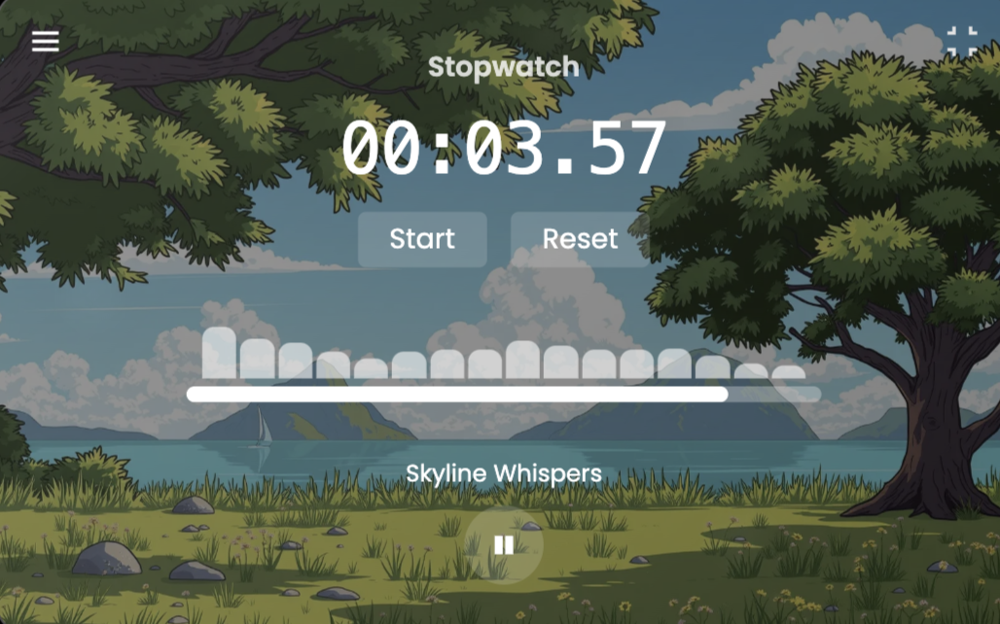

# Focal

Did you find it hard to focus on your task? Focal helps you block distraction and stay productive! 

  

---

## Inspiration
Many people find it challenging to focus, and most of the time, listening to music helps them concentrate better. To enhance this experience, we've integrated a stopwatch and timer into the music playlist, allowing users to manage their time efficiently while enjoying their favorite music.

## What it does
- Countdown timer and stopwatch to keep track of time with an integrated countdown timer and stopwatch
- Music player to lay your favorite tracks
- Playlist with track control so you can easily skip between different songs in your playlist
- Audio visualization effects that syncs with the music for an immersive experience
- Ability to change the background image based on your choice

## How we built it
This widget was built using React and Tailwindcss with some basic animations. We broke the UI elements down into parts, and implement it seperately, which makes the development process more efficient.

## Accomplishments that we're proud of
We successfully created a functional widget that I will use for my study :)

## What's next for Focal
The next thing I want to do with this widget is to implement a standalone cross platform app that integrates with different operating system. This will be a big step towards the app's avalability.
